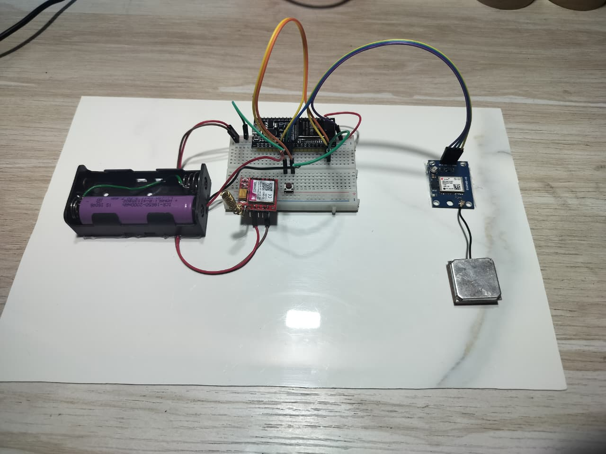
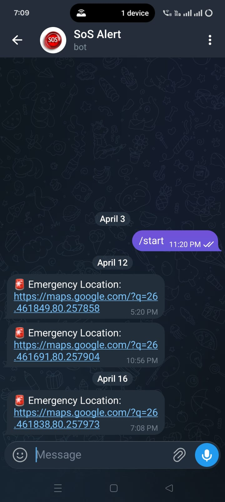
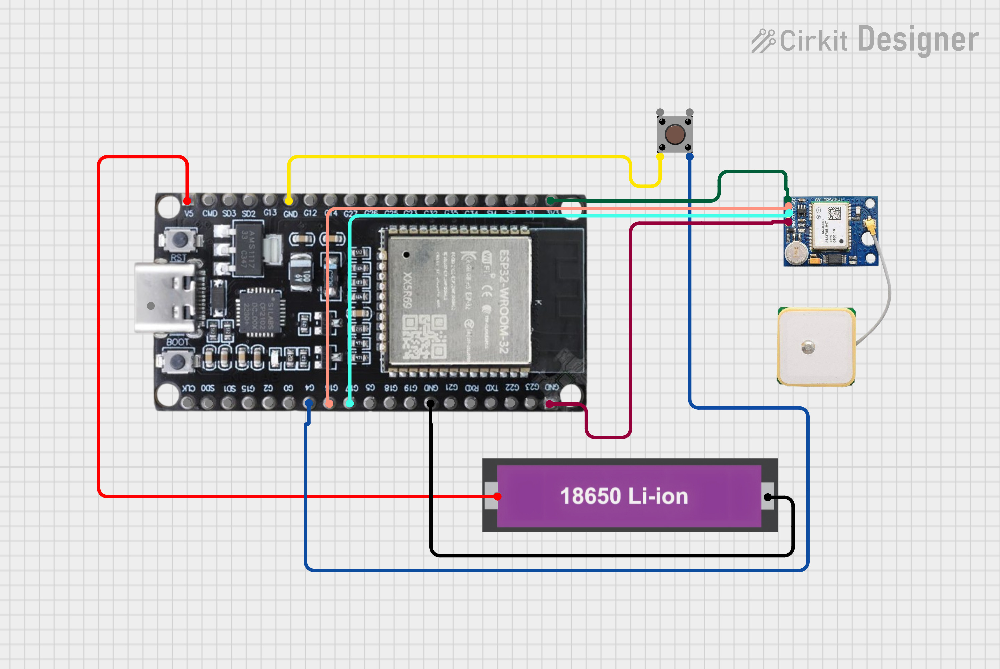

# SOS-Alert-System-using-Telegram-Bot
This project is an IoT-based SOS Alert System that sends emergency messages using a Telegram bot. When triggered, the system transmits real-time location coordinates via GPS (Neo-6M) and sends them instantly to predefined contacts through Telegram. It is designed for safety applications, providing quick communication in emergency situations.
# 🚨 SOS Alert System using Telegram Bot

## 📌 Description
This project is an IoT-based SOS alert system designed to send emergency notifications using a Telegram bot along with real-time GPS location. It enables quick communication during critical situations by sharing live location instantly.

## ⚙️ Components Used
- ESP32  
- GPS Module (Neo-6M)  
- Push Button  
- Jumper Wires  
- Internet Connectivity  

## 🚀 Features
- Real-time GPS location tracking  
- Instant alert via Telegram bot  
- One-click emergency trigger  
- Google Maps location sharing  

## 🔌 Working
When the SOS button is pressed, the ESP32 reads GPS coordinates from the Neo-6M module and sends them through a Telegram bot. The message includes a Google Maps link for accurate real-time location tracking.

## 📸 Project Images
  
  
  

## 📱 Telegram Output

## 🔧 Circuit Diagram

